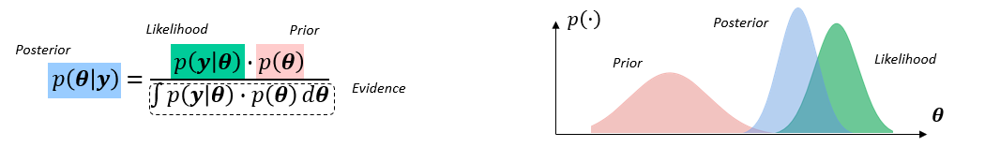
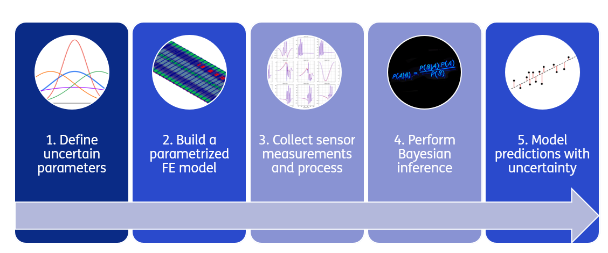

# Bayesian system identification

Performing Bayesian system identification is hard: 
- Complex statistical methods
- High computational costs
- Programming skills

Then… why doing it?
- ✅ Theoretically consistent method to integrate measurement data with structural models
- ✅ Estimates the uncertainties of predictions rather than just giving a ‘best guess’
- ✅ Incorporates knowledge of the structure via the priors

## Typical workflow

This how a typical workflow looks like: 

