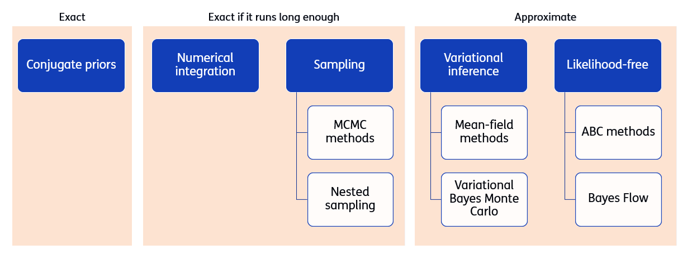

# Key Concepts
The heart of Bayesian inference is **Bayes' theorem**, which takes this form for continuous variables:

$$p(\boldsymbol{\theta}|\boldsymbol{y}) = \frac{p(\boldsymbol{y}|\boldsymbol{\theta}) \cdot p(\boldsymbol{\theta})}{\int p(\boldsymbol{y}|\boldsymbol{\theta}) \cdot p(\boldsymbol{\theta}) \, d\boldsymbol{\theta}}$$

or more intuitively:
$$\text{Posterior} = \frac{\text{Likelihood} \times \text{Prior}}{\text{Evidence}}$$

- **Parameters ($\boldsymbol{\theta}$)**: The unknown system properties we want to identify

- **Measurements ($\boldsymbol{y}$)**: Noisy sensor data from the system

- **Prior $p(\boldsymbol{\theta})$**: Parameter probabilities we assign before seeing data

- **Likelihood $p(\boldsymbol{y}|\boldsymbol{\theta})$**: Probability of observing the data given parameters

- **Posterior $p(\boldsymbol{\theta}|\boldsymbol{y})$**: Updated parameter knowledge after seeing data

## Methods for Bayesian inference

Bayesian inference methods can be categorized based on their computational approach:

- **Exact methods**: Conjugate priors provide analytical solutions when prior and posterior distributions belong to the same family
- **Exact methods (if run long enough)**: Numerical integration and sampling methods (MCMC, Nested sampling) that converge to exact solutions given sufficient computational time
- **Approximate methods**: Variational inference and likelihood-free methods that provide fast approximations to the posterior

> **_Note:_**  Approximate methods are not covered in this crash course.

## Applications
Some applications of Bayesian inference to structural engineering are:

1. Updating the resistance of a structure after passing a proof load test
2. Updating the reliability of a structure after it has survived a number of years
3. Updating the deterioration distribution on a structure after detecting corrosion in some areas
4. Updating the parameters of a finite element model after sensor data

The last application is known as system identification. Other names for it are Model updating and Model calibration.

